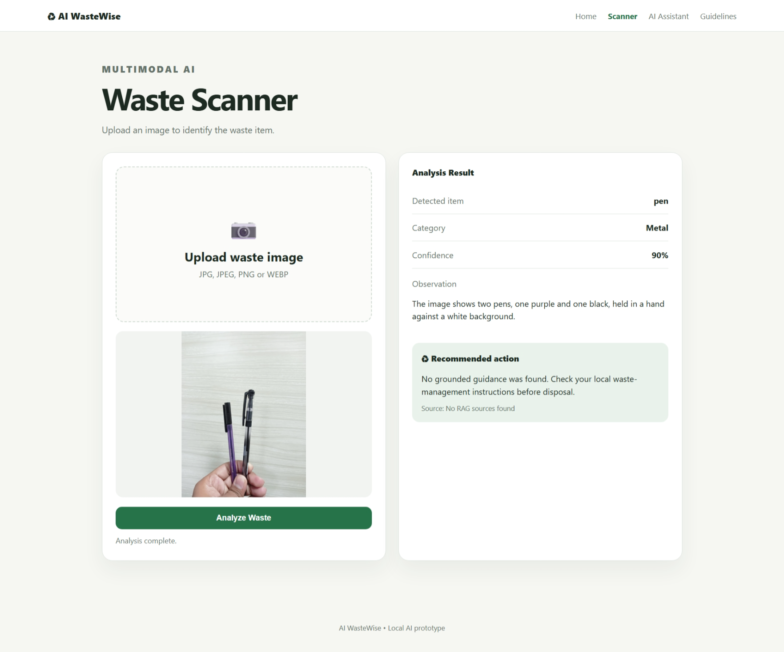
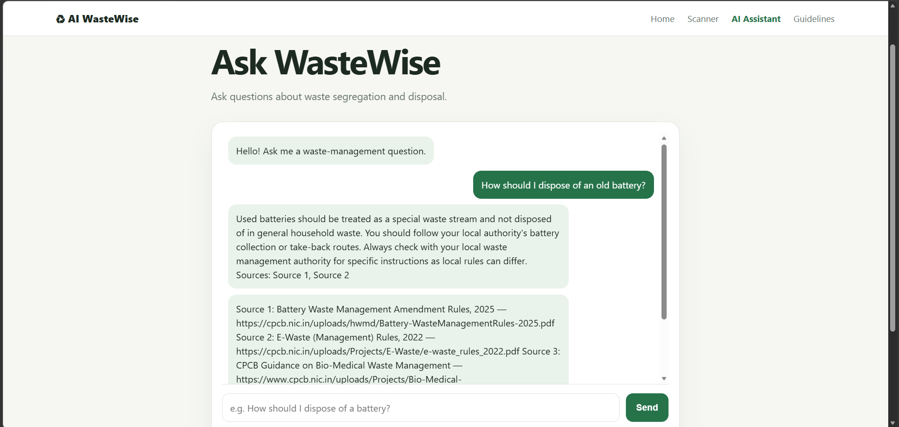
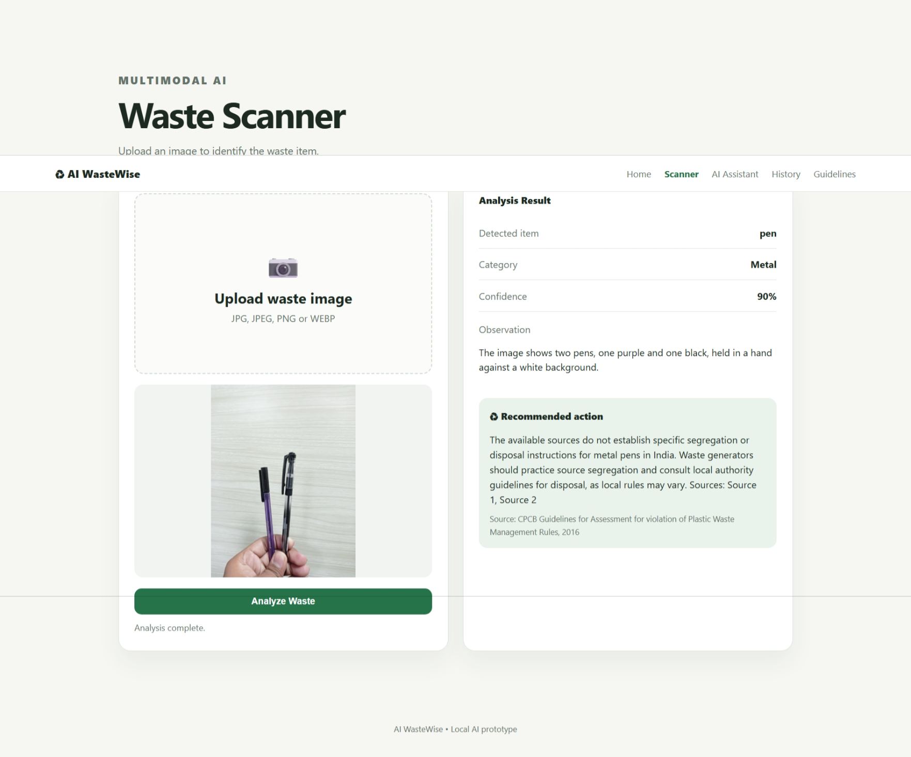
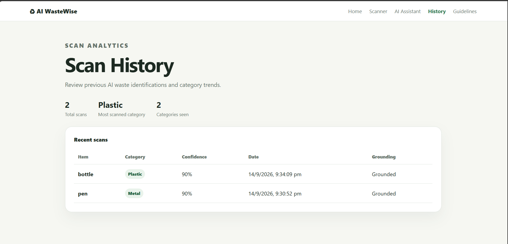
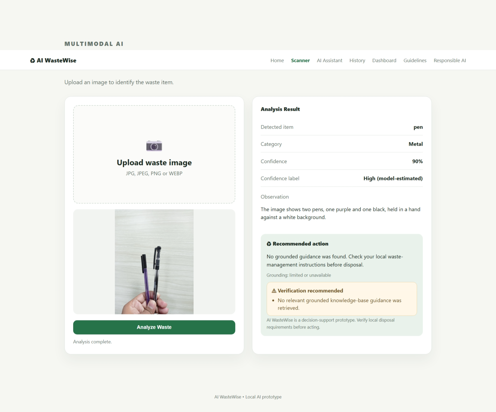

# ♻️ WasteWise

## Local AI-Powered Waste Segregation & Disposal Assistant

WasteWise is a local AI-powered sustainability application that combines **multimodal image analysis**, **category-aware Retrieval-Augmented Generation (RAG)**, **source-grounded recommendations**, **scan history**, **analytics**, and **human feedback** to assist users with waste segregation and disposal decisions.

This project was developed for the **1M1B AI for Sustainability Virtual Internship** and is aligned primarily with **SDG 12 — Responsible Consumption and Production**. It also supports the broader sustainability goal of SDG 11 through improved waste-management awareness and decision support.

> **Project status:** Stable prototype / internship-ready build
>
> **Latest local QA run:** 17 tests passed

---

## 🎯 Problem Statement

People often do not know how to correctly segregate or dispose of everyday items, especially special waste such as batteries and e-waste. Incorrect disposal can reduce the effectiveness of waste segregation and can create environmental and safety risks.

WasteWise addresses this problem with a local AI workflow that identifies waste from images, maps it to supported categories, retrieves relevant knowledge from a curated waste-management knowledge base, and produces a grounded recommendation with source information when appropriate.

---

## 💡 Solution

WasteWise provides two primary AI workflows.

### 1. Waste Scanner

```text
Waste Image
    ↓
Ollama Vision Model
    ↓
Item Identification
    ↓
Waste Category Normalization
    ↓
Category-aware RAG Retrieval
    ↓
Ollama Text Model
    ↓
Grounded Recommendation + Sources
    ↓
Human Feedback
    ↓
Scan History / Dashboard
```

### 2. AI Assistant

```text
User Question
    ↓
Query / Category Detection
    ↓
RAG Retrieval
    ↓
Relevant Knowledge
    ↓
Ollama Text Model
    ↓
Grounded Answer + Sources
```

---

## ✨ Key Features

- 📷 **Multimodal waste scanner** for image-based identification
- ♻️ **Eight supported waste categories**
- 🔎 **Category-aware RAG retrieval**
- 📚 **Source-grounded disposal guidance**
- 💬 **AI waste-management assistant**
- 🧾 **Scan history and category statistics**
- 📊 **WasteWise sustainability dashboard**
- 👤 **Human-in-the-loop feedback**
- 🛡️ **Responsible AI safeguards**
- 🔐 **Local security and privacy controls**
- 📱 **Responsive HTML/CSS/JavaScript UI**
- ⚡ **FastAPI REST backend**
- 🧠 **Local Ollama inference**
- 🗂️ **Local Qdrant vector storage**

---

## 🗑️ Supported Waste Categories

| Category | Example Use
|---|---|
| Organic | Food and biodegradable material
| Paper | Paper and cardboard items
| Plastic | Plastic packaging and containers
| Glass | Glass bottles and containers
| Metal | Small metal items
| E-waste | Electronic items / special handling streams
| Hazardous | Items requiring special disposal procedures
| Other / Unknown | Unsupported or unclear items

The application uses a controlled taxonomy so the model's free-form visual description is separated from the application's supported waste category.

---

## 🧰 Technology Stack

### Frontend

- HTML5
- CSS3
- JavaScript

### Backend

- Python
- FastAPI
- Uvicorn

### Local AI

- **Ollama**
- `qwen2.5vl:3b` — vision-language/image analysis
- `qwen3:4b` — grounded response generation and assistant
- `nomic-embed-text:latest` — embeddings

### Retrieval

- Qdrant (local persistent storage)
- Retrieval-Augmented Generation (RAG)

### Testing

- pytest

---

## 🏗️ System Architecture

```text
                           WASTEWISE
                               │
                   HTML + CSS + JavaScript
                               │
                             FastAPI
                               │
              ┌────────────────┴────────────────┐
              │                                 │
              ▼                                 ▼
       Ollama Vision                       RAG Pipeline
       qwen2.5vl:3b                            │
              │                         nomic-embed-text
              ▼                                 │
      Item Identification                        ▼
              │                               Qdrant
              ▼                                 │
      Category Normalization                    │
              │                                 │
              └──────────────┬──────────────────┘
                             ▼
                         qwen3:4b
                             │
                             ▼
                 Grounded Answer / Guidance
                             │
                ┌────────────┼─────────────┐
                ▼            ▼             ▼
             Sources      Feedback      History
                                           │
                                           ▼
                                       Dashboard
```

Detailed documentation: [`docs/architecture.md`](docs/architecture.md)

---

## 📁 Project Structure

```text
WasteWise/
│
├── backend/
│   ├── api/
│   ├── data/
│   │   └── knowledge_base/
│   ├── models/
│   └── services/
│
├── frontend/
│   ├── css/
│   └── js/
│
├── tests/
├── docs/
│   ├── screenshots/
│   ├── architecture.md
│   ├── final-qa.md
│   ├── security-and-privacy.md
│   └── ui-ux-polish.md
│
├── .env.example
├── .gitignore
├── pytest.ini
├── requirements.txt
└── README.md
```

Runtime artifacts such as local Qdrant data, scan history, feedback, Python caches, `.venv`, and `.env` are intentionally excluded from version control.

---

## 🚀 Prerequisites

Install:

- Python 3.13 (the development environment used for the latest QA run)
- Ollama
- Git

Verify:

```bash
python --version
ollama --version
git --version
```

---

## 🤖 Ollama Models

Install the local models:

```bash
ollama pull qwen2.5vl:3b
ollama pull qwen3:4b
ollama pull nomic-embed-text:latest
```

Verify:

```bash
ollama list
```

---

## ⚙️ Installation

Clone the repository:

```bash
git clone https://github.com/YOUR_USERNAME/WasteWise.git
cd WasteWise
```

Create a virtual environment:

```powershell
python -m venv .venv
.venv\Scripts\activate
```

Install dependencies:

```powershell
python -m pip install -r requirements.txt
```

---

## ▶️ Run WasteWise

Make sure Ollama is running and the required models are available.

Start the FastAPI server from the project root:

```powershell
uvicorn backend.main:app --reload --host 127.0.0.1 --port 8000
```

Open the application:

```text
http://127.0.0.1:8000/
```

Open the interactive API documentation:

```text
http://127.0.0.1:8000/docs
```

---

## 🔎 RAG Setup

WasteWise uses a local Qdrant store and `nomic-embed-text:latest` for embeddings.

After changing the knowledge base, rebuild the index using the RAG reindex endpoint exposed by FastAPI.

In Swagger:

```text
POST /api/rag/reindex
```

Then verify:

```text
GET /api/rag/status
```

The retrieval layer uses category-aware scoring and fallback behavior so that relevant category evidence is preferred and unsupported item-specific claims are avoided.

---

## 🧪 Testing

Run the automated test suite:

```powershell
python -m pytest
```

Latest development QA result:

```text
17 passed
```

For the manual test matrix, see [`docs/final-qa.md`](docs/final-qa.md).

---

## 🛡️ Responsible AI

WasteWise treats AI as decision support rather than unquestionable authority.

### Fairness

Waste classification is based on the uploaded item and supported categories, not personal characteristics.

### Transparency

The application shows the detected category, a model-estimated confidence label, grounding status, and available sources.

### Ethics

The system avoids presenting unsupported or uncertain disposal guidance as guaranteed fact.

### Privacy

Inference is designed to run locally through Ollama. Users should avoid uploading unnecessary personal or sensitive information.

### Human Verification

Low-confidence, unknown, special-waste, hazardous, or weakly grounded results can be flagged for verification.

See [`frontend/responsible-ai.html`](frontend/responsible-ai.html) and [`docs/security-and-privacy.md`](docs/security-and-privacy.md).

---

## 👤 Human-in-the-Loop Feedback

The scanner allows users to indicate whether an AI result was correct and, when applicable, submit a corrected category.

Feedback is used for **evaluation and quality analysis**; it is not automatically used to retrain the model. Runtime feedback data is excluded from Git version control.

---

## 📊 Dashboard & History

WasteWise records local scan history and provides dashboard views for:

- total scans
- categories seen
- waste distribution
- grounding quality
- scans requiring review
- recent activity
- feedback metrics

These prototype analytics are intended to demonstrate how AI-assisted waste identification can be evaluated and monitored.

---

## 📸 Screenshots

### Waste Scanner



### AI Assistant



### Scan History



### Dashboard



### Responsible AI



---

## ⚠️ Limitations

- Image identification can be incorrect for mixed, damaged, partially visible, or unusual items.
- Waste-management requirements can vary by location and collection system.
- RAG quality depends on the coverage and quality of the knowledge base.
- Model-estimated confidence is not a calibrated probability.
- WasteWise is an AI-assisted prototype and should not replace official local guidance for operational or regulatory decisions.

---

## 🌱 SDG Alignment

### Primary SDG

**SDG 12 — Responsible Consumption and Production**

### Secondary relevance

**SDG 11 — Sustainable Cities and Communities**

The internship guidance asks students to select a primary SDG and connect a real sustainability problem to an appropriate AI workflow.

---

## 📈 Expected Impact

WasteWise is intended to:

- improve awareness of waste segregation
- make disposal information easier to access
- encourage better handling of recyclable and special waste
- support source-grounded sustainability decisions
- demonstrate responsible local AI for sustainability

---

## 🔭 Future Scope

Potential extensions include:

- broader and more diverse waste-image coverage
- stronger mixed-waste detection
- location-specific disposal rules
- multilingual support
- richer sustainability analytics
- additional sustainability modules

---

## 🔐 Git & Version Control

The repository intentionally excludes runtime and secret files. See [`.gitignore`](.gitignore).

Recommended workflow:

```text
Create / modify
     ↓
Test locally
     ↓
git status
     ↓
git add .
     ↓
git commit -m "..."
     ↓
git push
```

Do not commit:

```text
.venv/
.env
backend/data/qdrant/
backend/data/scan_history.json
backend/data/feedback.json
__pycache__/
.pytest_cache/
```

---

## 📄 Internship Alignment

WasteWise is designed around the internship project requirements: real-world sustainability problem, SDG alignment, meaningful use of AI, prototype/demo evidence, Responsible AI, and expected impact.

---

## 👨‍💻 Author

**Himanshu Kumar**

Developed as part of the **1M1B AI for Sustainability Virtual Internship**.
